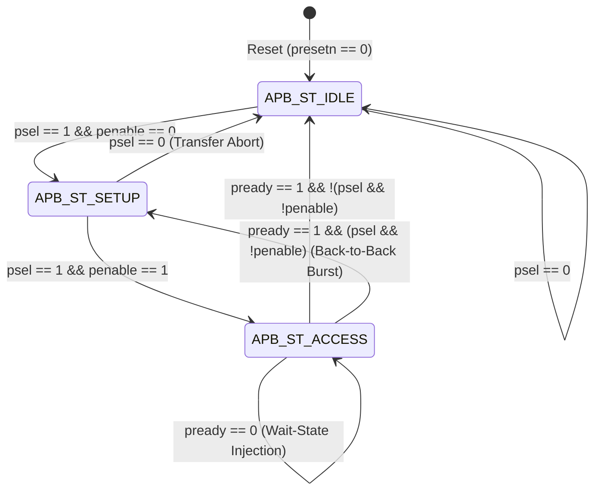

# FSM & State Diagram Specification: APB Slave Controller

**Module**: `apb_slave_fsm`  
**Team 7**: Bhuvanesh S, Aathithya K, Pradeep  
**Protocol Compliance**: AMBA APB3 / APB4 Handshake Specification  
**Version**: 1.0  

---

## 1. APB Protocol Finite State Machine (FSM)

The APB Slave interface conforms to the canonical 3-state Mealy/Moore hybrid FSM architecture with hardware-controlled wait-state extension.

### 1.1 State Definitions
| State Name | Encoded Value | Description | Output Behaviors |
| :--- | :---: | :--- | :--- |
| `APB_ST_IDLE` | `2'b00` | Default unselected state. The slave ignores activity on data buses. | `PREADY = 1`, `PSLVERR = 0`, `PRDATA = 32'h0` |
| `APB_ST_SETUP`| `2'b01` | Selected for transfer. Address, direction, and write data are decoded. | `PREADY = 1` (default), `PSLVERR = 0`, `reg_write = 0` |
| `APB_ST_ACCESS`| `2'b10` | Strobe active. Handshake resolution, wait-state evaluation, data commitment. | `PREADY = (wait_cnt >= wait_states)`<br>`PSLVERR = (error && pready)`<br>`reg_write = (psel && penable && pready && pwrite)` |

---

## 2. State Transition Diagram (Mermaid)



---

## 3. State Transition Logic Table

| Current State | Condition (`psel`, `penable`, `pready`) | Next State | Bus Actions & Register Strobes |
| :---: | :---: | :---: | :--- |
| `APB_ST_IDLE` | `psel == 0` | `APB_ST_IDLE` | Inactive bus. `wait_counter <= 0`. |
| `APB_ST_IDLE` | `psel == 1 && penable == 0` | `APB_ST_SETUP` | Setup cycle begins. Register address decoded. |
| `APB_ST_SETUP` | `psel == 1 && penable == 1` | `APB_ST_ACCESS` | Strobe asserted. Wait counter begins evaluation. |
| `APB_ST_SETUP` | `psel == 0` | `APB_ST_IDLE` | Premature deassertion; returns safely to IDLE. |
| `APB_ST_ACCESS` | `pready == 0` (`wait_cnt < wait_states`) | `APB_ST_ACCESS` | Wait-state injected. Master holds bus signals stable. `wait_counter <= wait_counter + 1`. |
| `APB_ST_ACCESS` | `pready == 1 && psel == 0` | `APB_ST_IDLE` | Transfer completed. Data committed to registers / sampled by master. `wait_counter <= 0`. |
| `APB_ST_ACCESS` | `pready == 1 && psel == 1 && penable == 0` | `APB_ST_SETUP` | Back-to-back burst transfer. Direct transition without idle cycles. |

---

## 4. Hardware Wait-State Injection Flowchart

```
                 +--------------------------+
                 |  Enter APB_ST_ACCESS     |
                 +--------------------------+
                              |
                              v
             /---------------------------------\
            <  wait_counter >= wait_states_i ?  >
             \---------------------------------/
                       /             \
                 NO   /               \  YES
                     v                 v
        +-----------------------+  +-----------------------+
        |  PREADY = 0           |  |  PREADY = 1           |
        |  Hold Transfer        |  |  Enable Commits       |
        |  wait_counter <= + 1  |  |  Commit Read/Write    |
        +-----------------------+  +-----------------------+
                     |                         |
                     v                         v
        +-----------------------+  +-----------------------+
        | Next Clock Edge       |  | Conclude Transfer     |
        | Stay in ACCESS        |  | Return to IDLE/SETUP  |
        +-----------------------+  +-----------------------+
```

---

## 5. PSLVERR Protocol Error Generation

The error output is generated combinationally and asserted strictly during the terminal access cycle:

```systemverilog
assign pslverr = psel && penable && pready && reg_error_i;
```

Where `reg_error_i` is asserted by the address decoder when:
1. `reg_addr_i[1:0] != 2'b00` (Unaligned access).
2. `reg_addr_i > 8'h1C` (Out-of-bounds address space).
3. `reg_write_i && (reg_addr_i == 8'h04 || reg_addr_i == 8'h14)` (Write to Read-Only `CRC_STATUS` or `CRC_RESULT`).

When `PSLVERR` is asserted:
- Write transfers do not modify any register contents.
- Read transfers output the bus error pattern `32'hDEADBEEF`.
- The interrupt status bit `INT_STAT[1]` (Error) is set.
